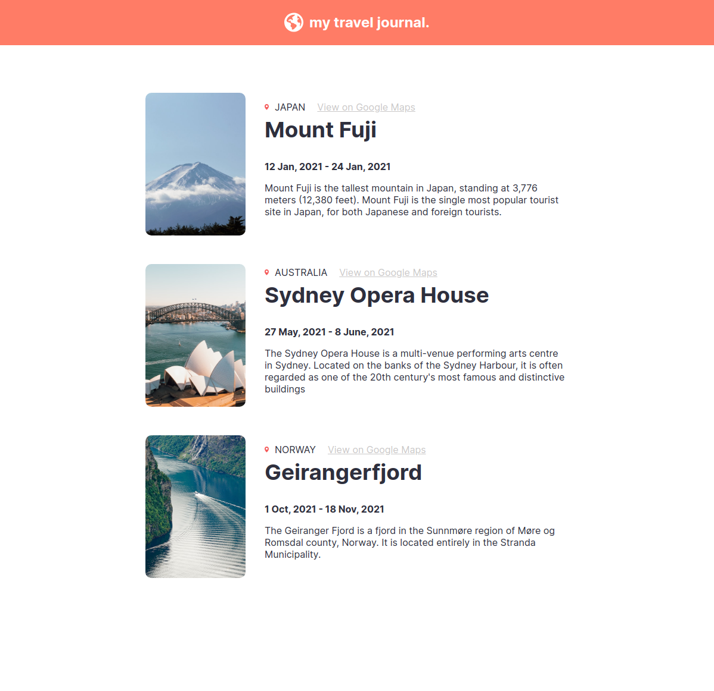
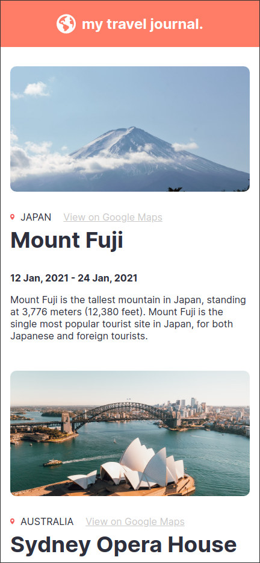

# Scrimba React Project #4: Travel journal

The goal of this solo project was to create a travel journal website in React.

I started and finished this project in May 2023.

## Assignment

[Scrimba - Learn React - #4 Solo project: Travel journal](https://scrimba.com/learn/learnreact)

## Technology

- React
- JavaScript
- Vite
- CSS

## Key Concepts

- JSX
- Custom components
- Custom attributes (props)
- .map() function: converting data into an array of JSX components

## Links

[Live Demo](https://brightneon7631.github.io/scrimba-travel-journal/)

[My Other Projects](https://brightneon7631.github.io/odin-scrimba-projects/)

## Screenshots

### Desktop



### Mobile



## Sources

- https://unsplash.com/photos/WLxQvbMyfas by Mike Prince
- https://unsplash.com/photos/JmuyB_LibRo by Caleb
- https://unsplash.com/photos/3PeSjpLVtLg by James Rathmell
- https://fonts.google.com/specimen/Inter

## Deployment

```bash
# clone repo
git clone

# install project dependencies
npm install

# run vite dev server
npm run dev

# create a production build
npm run build
```